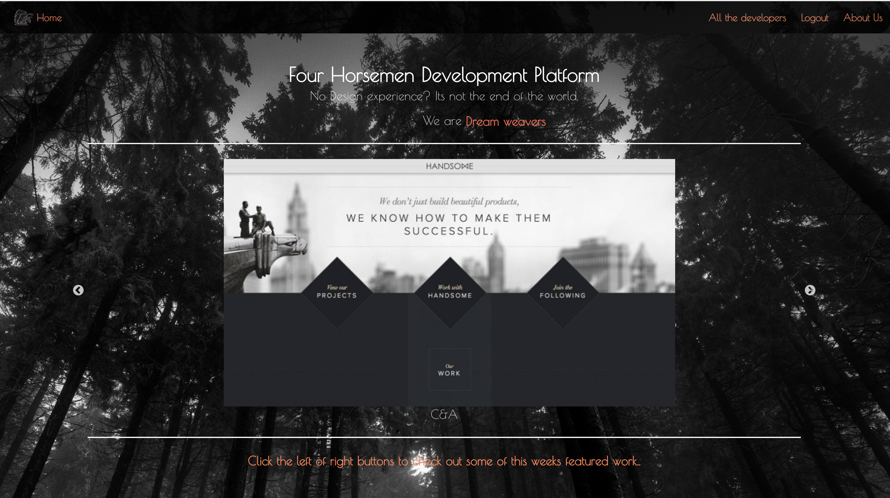
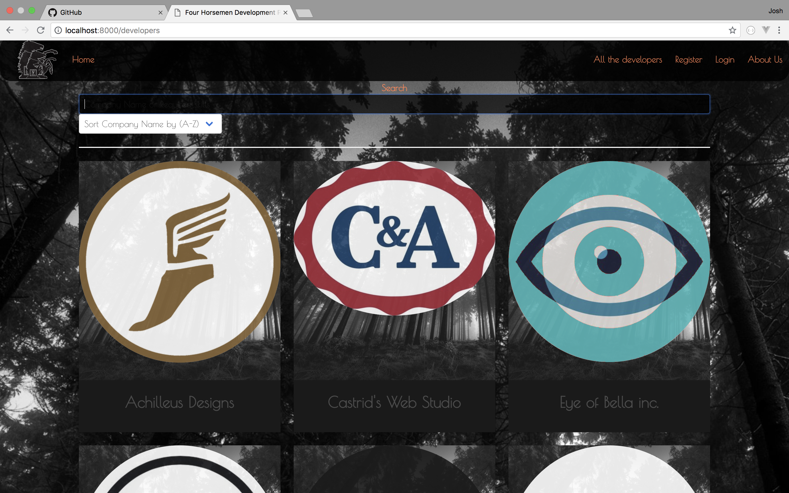
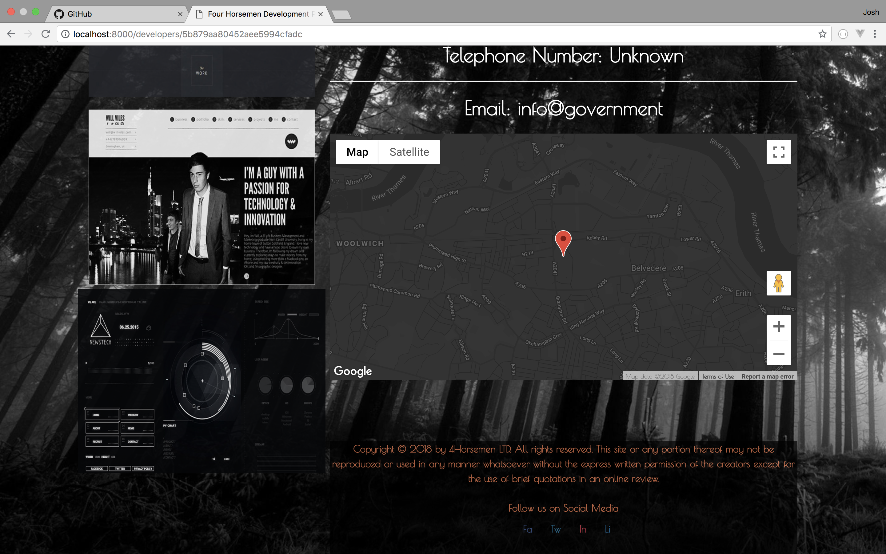
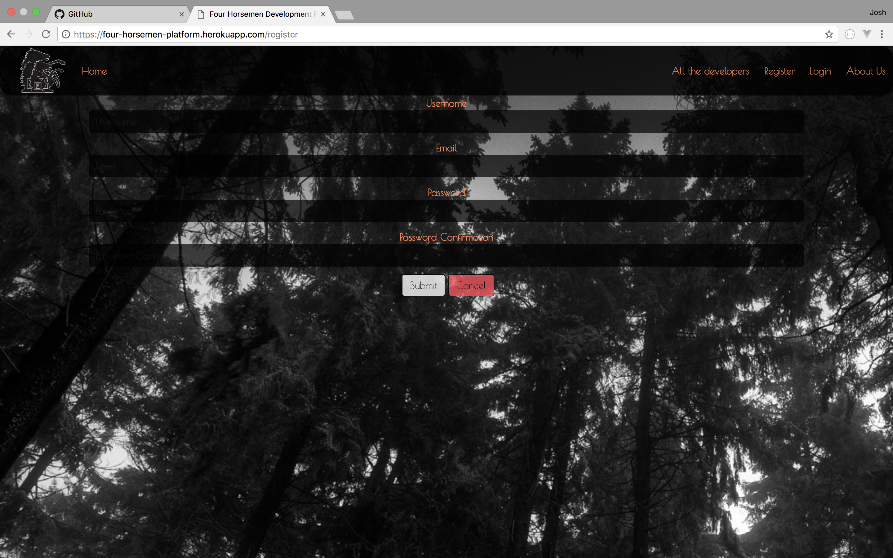
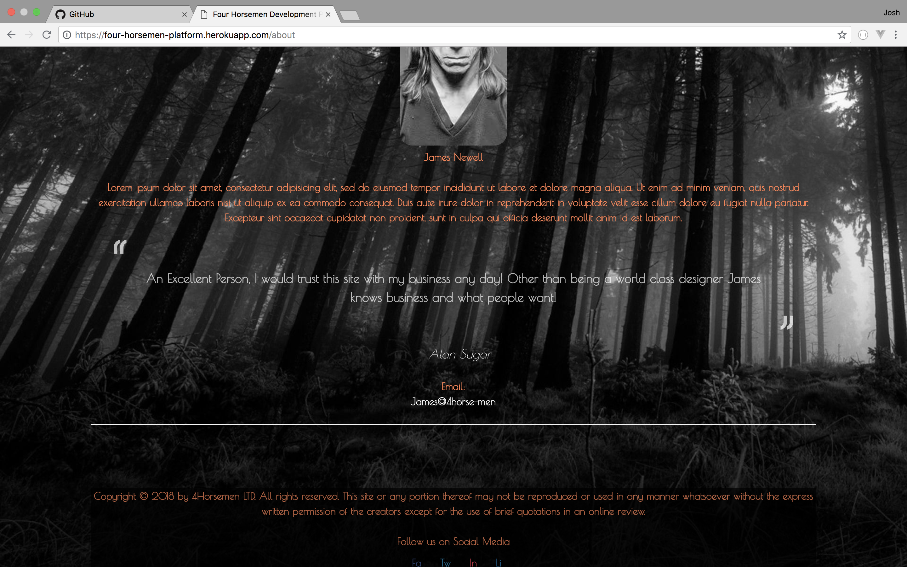

# WDI34_PROJECT_4
# Final Project

# GA WDI-34 Project 4 - Four Horsemen Development Platform
For our final project, we were given a week to build an app using everything we have learned over the course. While initially I started solo I eventually decided to work in a team of two.

## Key Skills Used

- HTML5
- Angular
- MongoDB
- API (of our choosing)
- SCSS
- JavaScript
- heroku
- Bulma
- Mocha
- Nodeemailer
- webpack
- Mongoose
- Express

##### Visit our [Site ](https://four-horsemen-platform.herokuapp.com) here
---
## Setup instructions
- Clone or download the repo
- Install dependencies with `yarn install`
- Launch the app with `gulp`

---
# Overveiw of the Four Horsemen App

This is our <b>Homepage</b>, it has a simple colour scheme which we kept throughout the site. I wanted to keep the design very minimal and so went for a black an white picture of trees, as I liked the theme of being lost in a digital age. I add the image carousel as I thought it was a good edition to capture peoples attention before their journey takes them further into the site. <b>The Navigation bar</b> is simple and kept to a minimum the only exception is our logo which evolved over time.

 

Clicking the <b>All Developers</b> button in the nav bar takes you to the page the app is built around, it is a list of all of the featured developers which can be filtered to list in an A - Z or Z - A order. 

 

 
This is the bottom of the <b>All Places</b> page, the gradient finishes bright and the footer is the same eggshell as the cards for each place. We decided to ask visitors to <b>Log in</b> or <b>Register</b> to add their own new place, we put links in the message to both Register and Login pages for ease and

This is the Registration page for new users, you get here either from clicking the <b>Navbar</b> button or from one of the links within the <b>All Places</b> or within each individual <b>Place</b>. The submit button is un-clickable unless all of the fields in the form are filled in. The page follows the same theme as the <b>All Places</b> page.
 
 

Once the form is filled the <b>Submit button</b> is now clickable.

 We decided to speed the logging in process up by having the <b>registration page</b> take you to the <b>login page</b> once the <b>registration</b> form had been correctly filled in.

 Once the user is logged in, the app will display their name in the Navbar and become a clickable link to their personal <b>Profile page</b>. 

<h2>Things we would like to add to the App:</h2>
 
 - We would like to have a search bar on the Homepage linked to <b>All Places</b>

 
 - We would have a functional <b>Profile page</b> which allows your <b>Comment Score</b> and <b>Profile Picture</b> to display. Also on the <b>Profile page</b> page a map showing your Location in relation to the other Places on the app.

 
- A Logo for the App

- An Animated Homepage that displays our apps features

- A carousel of our Places

---
# Final Thoughts

<b>Antoni (Project Manager)</b> -

- I found it Interesting working in group, other then being an important learning experience it also gave us the chance to see how we would be working in our careers after the course.

- I found the most frustrating thing during this project to be the styling aspect of it. It took much longer then I envisaged, however it was nice to work as a team and get their input and bounce ideas off of each other.
- I think as a group we underestimated how long things would take to implement, and I think at times we should of prioritised things in a different way.

<b>Brad</b> -

- If we had to start again I Would want a better understanding of implementing things we hadn't used yet such as Geolocation, Directions and other Api's (a whole days worth of searching for how to implement them.

- We suffered delays in the first few days which were caused by using Github as a group for the first time, working on inccorect branch's, not pushing, not pulling. These are all teething problems and I know next time I'll have a much better grip on Github.

- I think we started of feeling a bit too confident and got a bit lax with out time managemnet which led to us having to pick up the strain later on, which lead to features being left out.

<b>Josh</b> -

- I enjoyed working as a team, my initial concern was my ability compared to the rest of the group. However this was alleviated from day one, when I realised the project was the goal and no one was there to put anyone else down.

- A challenge for me during the Project was tying the User Profile to the other feature in the app. I came away slightly deflated as the page does not work, but I know that failure this time will only improve my in the next project.

- I enjoyed using Trello to manage our time and I think we worked well as a team, there were no arguments and we worked through everything together, with daily group stand-ups and constant communication, especially when things went wrong.
