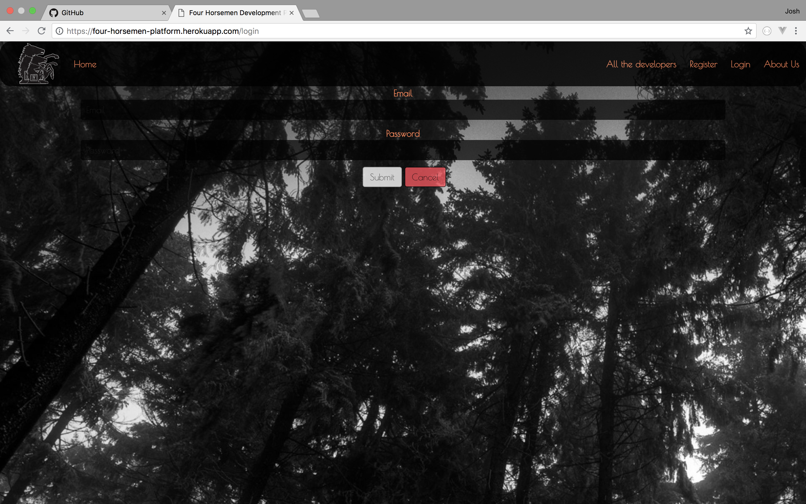

# WDI34_PROJECT_4
# Final Project

# GA WDI-34 Project 4 - Four Horsemen Development Platform
For our final project, we were given a week to build an app using everything we have learned over the course. While initially I started solo I eventually decided to work in a team of two.

## Key Skills Used

- HTML5
- Angular
- MongoDB
- API (of our choosing)
- SCSS
- JavaScript
- heroku
- Bulma
- Mocha
- Nodeemailer
- webpack
- Mongoose
- Express

### Visit the [Site ](https://four-horsemen-platform.herokuapp.com) here
---
## Setup instructions
- Clone or download the repo
- Install dependencies with `yarn install`
- Launch the app with `gulp`

---
# Overveiw of the Four Horsemen App

This is our <b>Homepage</b>, it has a simple colour scheme which we kept throughout the site. I wanted to keep the design very minimal and so went for a black an white picture of trees, as I liked the theme of being lost in a digital age. I add the image carousel as I thought it was a good edition to capture peoples attention before their journey takes them further into the site. <b>The Navigation bar</b> is simple and kept to a minimum the only exception is our logo which evolved over time.

 

Clicking the <b>All the Developers</b> button in the nav bar takes you to the page the app is built around, it is a list of all of the featured developers which can be filtered to list in an A - Z or Z - A order, clicking on any of these developer icons will take you to the individual company page.

 

 
This is the <b>Company</b> page, listing important infomation a potential client would want to see. I added a mini portfolio on the left hand side to showcase each companies work.

 

Scrolling down to the bottom of the <b>Company</b> page shows off the Googlemap for each company.
 
 

The <b>Registration</b> page for new clients

The <b>Login</b> page

We decided to personalise the site and add an <b>About</b> page, I think that companies that do this make them selves more approachable by their customers, giving a face to the business. 

<h2>Things we would like to add to the App:</h2>
 
 - Mobile App 

 
 - Better email system (Mailchimp)

 
 - A professional Logo for the App

- bigger buttons for the carousel

- text message alerts for clients

- chat between client and customer

---
# Final Thoughts

While some things don't work as intended I really enjoyed this project. I had a concept before I started this app and did not have the time to complete it as I envisioned so I feel with the completion of this project it has given me the confidence to begin work on my original concept. 

 I think one of the things I enjoyed learning on this project is to trust in the team and your own abilities!

